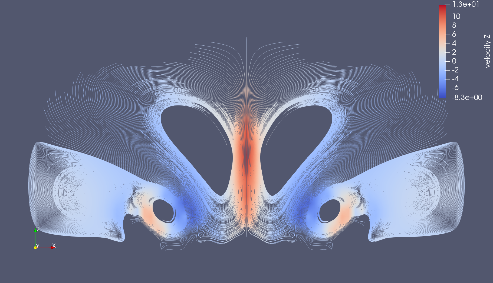
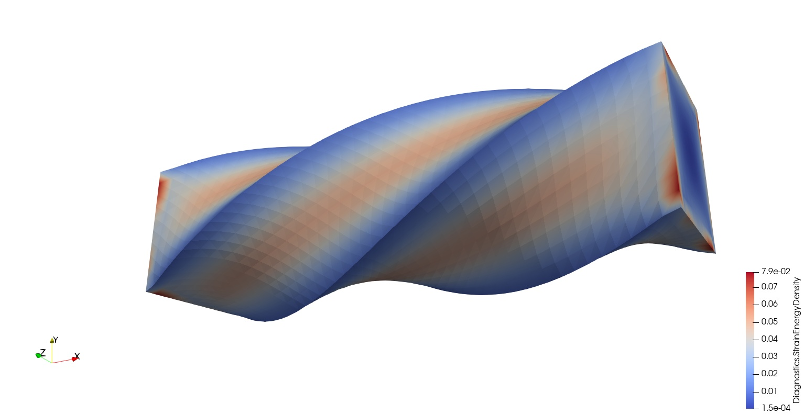

# Summary

Finite element methods are widely used to solve partial differential equations (PDE) in science and engineering, but their standard implementation [@dealII92;@libMeshPaper;@LoggMardalWells2012] relies on assembly sparse matrices, resulting in less than 2% utilization of arithmetic units on modern architectures [@kruppcomparison].
Matrix assembly becomes even more problematic when the polynomial degree $p$ of the basis functions is increased, resulting in $O(p^d)$ storage and $O(p^{2d})$ compute per degree of freedom (DoF) in $d$ dimensions.
Methods pioneered by the spectral element community [@Orszag:1980; @deville2002highorder] exploit problem structure to reduce costs to $O(1)$ storage and $O(p)$ compute per DoF, with very high utilization of modern CPUs and GPUs.
Unfortunately, high-quality implementations have been relegated to applications and intrusive frameworks that are often difficult to extend to new problems or incorporate into legacy applications, especially when strong preconditioners are required.

`libCEED`, the Code for Efficient Extensible Discretization [@libceed-user-manual], is a lightweight library that provides a purely algebraic interface for operators and and preconditioners with element-based discretizations.
`libCEED` provides portable performance via run-time selection of implementations optimized for CPUs and GPUs.
It is designed for convenient use in new and legacy software, and offers interfaces in C99 [@C99-lang], Fortran77 [@Fortran77-lang], Python [@Python-lang], Julia [@Julia-lang], and Rust [@Rust-lang].
Users and library developers can integrate `libCEED` at a low level into existing applications in place of existing matrix-vector products without significant refactoring of their own discretization infrastructure.
Alternatively, users can utilize integrated `libCEED` support in MFEM [@MFEMlibrary; @mfem-paper].

In addition to supporting applications and discretization libraries, `libCEED` provides a platform for performance engineering and co-design, as well as an algebraic interface for solvers research like adaptive $p$-multigrid, much like how sparse matrix libraries enable development and deployment of algebraic multigrid solvers.

# Concepts and interface

A finite element discretization of an $H^1$ problem is based on a weak form: find $u$ such that

$$ v^T F(u) := \int_\Omega v \cdot f_0(u, \nabla u) + \nabla v \!:\! f_1(u, \nabla u) = 0 \quad \forall v, $$

where the functions $f_0$ and $f_1$ define the physics and possible stabilization of the problem [@Brown:2010] and the functions $u$ and $v$ live in a suitable space.
Integrals in the weak form are evaluated by summing over elements $e$,

$$ F(u) = \sum_e \mathcal E_e^T B_e^T W_e f(B_e \mathcal E_e u), $$

where $\mathcal E_e$ restricts to element $e$, $B_e$ evaluates solution values and derivatives to quadrature points, $f$ acts independently at quadrature points, and $W_e$ is a (diagonal) weighting at quadrature points.
By grouping the operations $W_e$ and $f$ into a point-block diagonal $D$ and stacking the restrictions $\mathcal E_e$ and basis actions $B_e$ for each element, we can express the global residual in operator notation (\autoref{fig:decomposition}), where $\mathcal P$ is an optional external operator, such as the parallel restriction in MPI-based [@gropp2014using] solvers. 
Inhomogeneous Neumann, Robin, and nonlinear boundary conditions can be added in a similar fashion by adding terms integrated over boundary faces while Dirichlet boundary conditions can be added by setting the target values prior to applying the operator representing the weak form.
Similar face integral terms can also be used to represent discontinuous Galerkin formulations.

`libCEED`'s native C interface is object-oriented, providing data types for each logical object in the decomposition.

Symbol        libCEED type             Description
------        ------------             -----------
$D$           `CeedQFunction`          User-defined action at quadrature points
$B$           `CeedBasis`              Basis evaluation to quadrature (dense/structured)
$\mathcal E$  `CeedElemRestriction`    Restriction to each element (sparse/boolean)
$A$           `CeedOperator`           Linear or nonlinear operator acting on L-vectors

`libCEED` implementations ("backends") are free to reorder and fuse computational steps (including eliding memory to store intermediate representations) so long as the mathematical properties of the operator $A$ are preserved.
A `CeedOperator` is composed of one or more operators defined as in \autoref{fig:decomposition}, and acts on a `CeedVector`, which typically encapsulates zero-copy access to host or device memory provided by the caller.
The element restriction $\mathcal E$ requires mesh topology and a numbering of DoFs, and may be a no-op when data is already composed by element (such as with discontinuous Galerkin methods).
The discrete basis $B$ is the purely algebraic expression of a finite element basis (shape functions) and quadrature; it often possesses structure that is exploited to speed up its action.
Some constructors are provided for arbitrary polynomial order $H^1$ Lagrange bases with a tensor-product representation due to the computational efficiency of computing solution values and derivatives at quadrature points via tensor contractions.
However, the user can define a `CeedBasis` for arbitrary geometry elements, to include tetrahedra, by providing quadrature weights and the matrices used to compute solution values and derivatives at quadrature points from the DoFs on the element.
The physics (weak form) is expressed through `CeedQFunction`, which can either be defined by the user or selected from a gallery distributed with `libCEED`.
These pointwise functions do not depend on element resolution, topology, or basis degree, 
This isolation is valuable for $hp$-refinement studies (where $h$ commonly denotes the average element size and $p$ the polynomial degree of the basis functions) and $p$-multigrid solvers.
Additionally, a single source implementation (in vanilla C or C++) for the `CeedQFunction`s can be used on CPUs or GPUs (transparently using the NVRTC [@NVRTCwebsite], HIPRTC, or OCCA [@OCCAwebsite] run-time compilation features).

`libCEED` provides computation of the true operator diagonal for preconditioning with Jacobi and Chebyshev as well as automatic construction of p-multigrid prolongation and restriction operators from a `CeedOperator`.
Preconditioning matrix-free operators is an active area of research; support for domain decomposition methods and inexact subdomain solvers based on the Fast Diagonalization Method are in active development.
Additionally, `libCEED` supports meshes with mixed order and geometry elements, which means `libCEED` can support solvers and preconditioners utilizing adaptive mesh refinement.

# High-level languages

`libCEED` provides high-level interfaces in Python, Julia, and Rust, each of which is maintained and tested as part of the main repository, but distributed through each language's respective package manager.

The Python interface uses CFFI, the C Foreign Function Interface [@python-cffi]. CFFI allows reuse of most C declarations and requires only a minimal adaptation of some of them. The C and Python APIs are mapped in a nearly 1:1 correspondence. For instance, a `CeedVector` object is exposed as `libceed.Vector` in Python, and may reference memory that is also accessed via Python arrays from the NumPy [@NumPy] or Numba [@Numba] packages to access host or GPU device memory. The interested reader can find more details on `libCEED`'s Python interface in [@libceed-paper-proc-scipy-2020].

The Julia interface, referred to as `LibCEED.jl`, provides both a low-level interface, which is generated automatically from `libCEED`'s C header files, and a high-level interface. The high-level interface takes advantage of Julia's metaprogramming and just-in-time compilation capabilities to enable concise definition of Q-functions that work on both CPUs and GPUs, along with their composition into operators as in \autoref{fig:decomposition}.

The Rust interface also wraps automatically-generated bindings from the `libCEED` C header files, offering increased safety due to Rust ownership and borrow checking, and more convenient definition of Q-functions (e.g., via closures).

# Backends

\autoref{fig:libCEEDBackends} shows a subset of the backend implementations (backends) available in libCEED.
GPU implementations are available via pure CUDA [@CUDAwebsite] and pure HIP [@HIPwebsite], as well as the OCCA [@OCCAwebsite] and MAGMA [@MAGMAwebsite] libraries. CPU implementations are available via pure C and AVX intrinsics as well as the LIBXSMM library [@LIBXSMM]. libCEED provides a unified interface, so that users only need to write a single source code and can select the desired specialized implementation at run time. Moreover, each process or thread can instantiate an arbitrary number of backends on an arbitrary number of devices.

# Performance benchmarks

The Exascale Computing Project (ECP) co-design Center for Efficient Exascale Discretization [@CEEDwebsite] has defined a suite of Benchmark Problems (BPs) to test and compare the performance of high-order finite element implementations [@Fischer2020scalability; @CEED-ECP-paper]. \autoref{fig:bp3} compares the performance of `libCEED` solving BP3 (CG iteration on a 3D Poisson problem) or CPU and GPU systems of similar (purchase/operating and energy) cost. These tests use PETSc [@PETScUserManual] for unstructured mesh management and parallel solvers; a similar implementation with comparable performance is available through MFEM. 

![Performance for BP3 using the \texttt{xsmm/blocked} backend on a 2-socket AMD EPYC 7452 (32-core, 2.35GHz) and the \texttt{cuda/gen} backend on LLNL's Lassen system with NVIDIA V100 GPUs. Each curve represents fixing the basis degree $p$ and varying the number of elements. The CPU enables faster solution of smaller problem sizes (as in strong scaling) while the GPU is more efficient for applications that can afford to wait for larger sizes. Note that the CPU exhibits a performance drop when the working set becomes too large for L3 cache (128 MB/socket) while no such drop exists for the GPU. \label{fig:bp3}](img/bp3-2020.pdf)

# Demo applications and integration

To highlight the ease of library reuse for solver composition and leverage `libCEED`'s full capability for real-world applications, libCEED comes with a suite of application examples, including problems of interest to the fluid dynamics and solid mechanics communities.
The fluid dynamics example solves the 2D and 3D compressible Navier-Stokes equations using SU/SUPG stabilization and implicit, explicit, or IMEX time integration; \autoref{fig:NSvortices} shows vortices arising in the "density current" [@straka1993numerical] when a cold bubble of air reaches the ground.
The solid mechanics example solves static linear elasticity and hyperelasticity with load continuation and Newton-Krylov preconditioned by $p$-multigrid preconditioners; \autoref{fig:Solids} shows a twisted Neo-Hookean beam. Both of these examples have been developed using PETSc, where libCEED provides the matrix-free operator and preconditioner ingredient evaluation and PETSc provides the unstructured mesh management and parallel solvers.

`libCEED` also includes additional examples with PETSc, MFEM, and Nek5000 [@Nekwebsite].

If MFEM is built with `libCEED` support, existing MFEM users can pass `-d ceed-cuda:/gpu/cuda/gen` to use a `libCEED` fastest CUDA backend, and similarly for other backends.
The `libCEED` implementations, accessed in this way, currently provide MFEM users with the fastest operator action on CPUs and GPUs (CUDA and HIP/ROCm) without writing any libCEED Q-functions.

# Acknowledgements

This research is supported by the Exascale Computing Project (17-SC-20-SC), a collaborative effort of two U.S. Department of Energy organizations (Office of Science and the National Nuclear Security Administration) responsible for the planning and preparation of a capable exascale ecosystem, including software, applications, hardware, advanced system engineering and early testbed platforms, in support of the nations exascale computing imperative. We thank Lawrence Livermore National Laboratory for access to the Lassen and Corona machines.

# References
